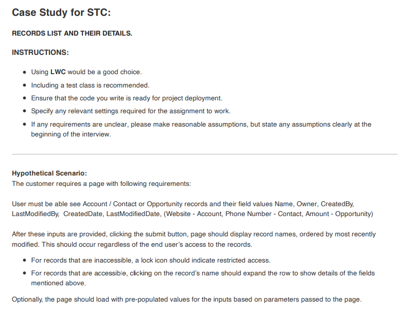
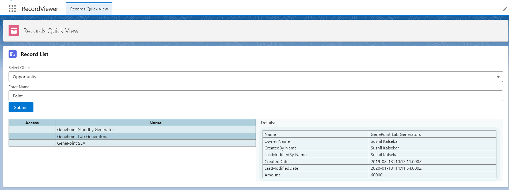

# RecordViewer Application

**RecordViewer** is a custom Salesforce application that enables users to search and view records across multiple standard objects (Account, Contact, Opportunity) via a Lightning Web Component (LWC) interface. The interface supports both direct interaction and deep linking via URL query parameters for quick access to specific data.

---
## 📖 Case Study

**Scenario Breakdown:** 

| Statement | Implication/Inference | Assumption |
| --------- | --------------------- | ---------- |
| User must be able see Account / Contact or Opportunity records | A list view of records is required for Account/Contact/Opportunity object ||
| and their field values Name, Owner, CreatedBy, LastModifiedBy, CreatedDate, LastModifiedDate, | Mentioned fields should be queried ||
| (Website - Account, Phone Number - Contact, Amount - Opportunity) | Object specific fields to be handled specifically ||
| After these inputs are provided, | Some inputs are expected | Inputs not clearly mentioned, hence, assuming inputs as object picker and name search as text based on completed context |
| clicking the submit button, | Submit button expected to trigger action ||
| page should display record names, | Requirement indicates only record names to be displayed ||
| ordered by most recently modified. | Records to be ordered based on last modified date ||
| This should occur regardless of the end user’s access to the records. | Logic running should ignore sharing settings for the user and fetch all available records matching the search criteria ||
| For records that are inaccessible, a lock icon should indicate restricted access. | Use lightning icon for lock to indicate restricted access to this record ||
| For records that are accessible, clicking on the record’s name should expand the row to show details of the fields mentioned above. | Record Name should be clickable and expand the row to show details | Row expansion handled as updating details in a panel on right hand side |
| Optionally, the page should load with pre-populated values for the inputs based on parameters passed to the page. | Page should be capable of handling parameters passed to the page | Assuming parameters are passed in URL |

## 💡 Thought Process

The application is supposed to solve a record searching problem and making record names available to the user irrespective of the access but that the same time enforcing restriction on granular data. 
The user should provide input in form of object name ( via dropdown) and a name phrase to search using the LIKE operator. Once all the matching records are fetched, the records are marked as visible or not and data is stripped from inaccessible records while only keeping the Id and the name field to be sent to the UI. Finally, the UI renders the records in tabular format and extends details of visible records in another table on the click event of record name. 

## 💻 UI Application View

---

## 📦 Components

### 💻 Application & FlexiPage
- **Custom Application**: `RecordViewer`
- **FlexiPage**: `Records_Quick_View`
  - Hosts the main Lightning Web Component `recordList`

### ⚙️ Apex Classes
- **RecordController**: Apex controller exposed to the LWC
  - `getRecordsByName(String objectName, String name)`
- **RecordSelector**: Helper class
  - `getFields(String objectType, String fieldSetName)`
  - `queryRecords(String objectType, Map<String,String> fieldMap, List<String> fieldSetFields)`
- **UserAccessController**: Handles record-level access checks
  - `getRecordsWithAccess(Id userId, List<SObject> records)`
  - `(private) getMapOfRecordAccess(Id userId, List<Id> recordIds)`

### 🔐 Permission Set
- **RecordViewerPermissions**: Grants access to the Apex classes used by the application

---

## ⚡ Lightning Web Component: `recordList`

### 🔧 Features
- **Dropdown** for selecting the object type (`Account`, `Contact`, `Opportunity`)
- **Search input** to enter the name (partial match supported via `LIKE` operator)
- **Submit button** to fetch matching records
- **Record display table** with:
  - Lock icon for records without access
  - Expandable row panel on the right for accessible records with detailed view

### 🔗 URL Query Parameters
The component supports deep linking by accepting the following URL query parameters:
- `c__objectname`: Object API name (e.g., `Account`)
- `c__name`: Name text to search (e.g., `Acme`)

**Example Usage:**
https://<your-salesforce-instance>/lightning/n/RecordViewer?c__objectname=Account&c__name=Acme

---

## 🔍 Record Fetch Logic

1. **User interaction or query parameters** trigger the `getRecordsByName` method in `RecordController`.
2. `RecordController`:
   - Calls `getFields` from `RecordSelector` using the appropriate FieldSet (e.g., `Account.BasicFields`)
   - Calls `queryRecords` with a `LIKE` search on the `Name` field
   - Passes results to `UserAccessController.getRecordsWithAccess` to determine field-level visibility
3. **Result Rendering**:
   - Accessible records show full field data
   - Inaccessible records display only `Name` with a lock icon

---

## 📁 FieldSets Used
- `Account.BasicFields`
- `Contact.BasicFields`
- `Opportunity.BasicFields`

These field sets define which fields are shown for each object when records are accessible.

---

## 🔒 Access Control
The 'RecordSelector' class operates in 'without sharing' context to fetch all records in the system.
The `UserAccessController` class ensures the records are filtered based on the access that the logged-in user has to specific records. Only the `Name` field is shown for inaccessible records, accompanied by a lock icon for clarity.

---

## 🛠️ Setup Instructions

1. Assign the `RecordViewerPermissions` permission set to users.
2. Ensure field sets (`BasicFields`) exist and are populated for Account, Contact, and Opportunity.
3. Deploy the application and add the `Records_Quick_View` FlexiPage to the navigation or utility bar as needed.

---

## 📬 Contact

For support or enhancements, please reach out to sushilkalsekar212@gmail.com .
